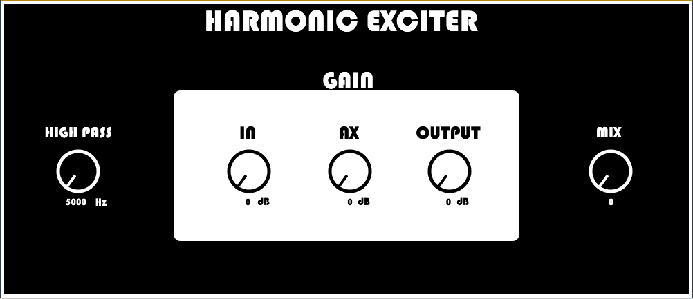

# Harmonic-exciter

This Plugin is based on a simple Harmonic Exciter whose parameters are managed with knobs. It is inspirated by Aphex aural exciter, following the same block diagram ilustrated in DAFX book.
The plugin generate harmonics using an half wave rectification, after these new harmonics are filtered with an high pass filter to delete low frequencies.
The AX Knob controle the harmonics gain.

# License

Harmonic Exciter is freely distributable and is covered by the terms of the GNU licensing agreement. Enjoy!
